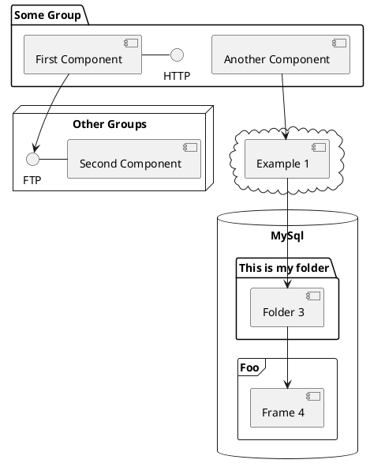

# How to make Technical interviews be more effective

Technical interviews could be nightmare for you. Here you can see ways to improve them.

<!--
The last comment block of each slide will be treated as slide notes. It will be visible and editable in Presenter Mode along with the slide. [Read more in the docs](https://sli.dev/guide/syntax.html#notes)
-->

---

# What is Slidev?

Slidev is a slides maker and presenter designed for developers, consist of the following features

- 📝 **Text-based** - focus on the content with Markdown, and then style them later
- 🎨 **Themable** - theme can be shared and used with npm packages
- 🧑‍💻 **Developer Friendly** - code highlighting, live coding with autocompletion
- 🤹 **Interactive** - embedding Vue components to enhance your expressions
- 🎥 **Recording** - built-in recording and camera view
- 📤 **Portable** - export into PDF, PNGs, or even a hostable SPA
- 🛠 **Hackable** - anything possible on a webpage

---

### Keyboard Shortcuts

aasdadsa
asdasdsa
asdasdas

---

# Diagrams

You can create diagrams / graphs from textual descriptions, directly in your Markdown. sdf ds fsd asdasdasdadasDa

<div class="grid grid-cols-3 gap-10 pt-4 -mb-6">

```mermaid {scale: 0.5}
sequenceDiagramв
    Alice->John: Hello John, how are you?
    Note over Alice,John: A typical interaction
```

``` {theme: 'neutral', scale: 0.8}
graph TD
B[Text] --> C{Decision}
C -->|One| D[Result 1]
C -->|Two| E[Result 2]
```
sdfsfs
  

</div>
